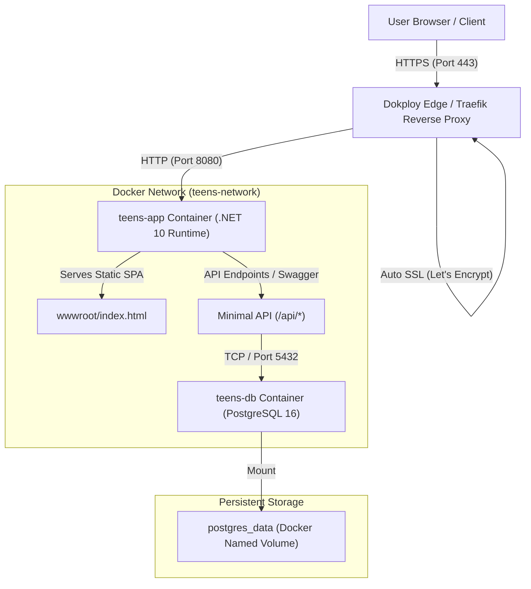

# Deployment Strategy: Teens Church Management System

This document outlines the architectural design, infrastructure choices, and CI/CD strategy implemented for deploying the **Teens Church Management System** to a Virtual Private Server (VPS) via **Dokploy**.

---

## 1. Architectural Overview

The deployment strategy utilizes a **unified containerized full-stack architecture** with a managed PostgreSQL persistence layer.



---

## 2. Core Architectural Decisions

### 2.1 Unified SPA & API in a Single Container (Recommended Pattern)
- **Problem**: Deploying separate containers for an SPA (Nginx) and a Backend API (.NET) introduces cross-origin (CORS) complexity, requires two domain/path routing rules, and doubles container memory overhead.
- **Solution**: ASP.NET Core’s built-in static file middleware (`app.UseDefaultFiles()` and `app.UseStaticFiles()`) serves `code.html` directly from `wwwroot/index.html`.
- **Benefits**:
  - **Zero CORS Configuration**: All API requests (`/api/members`, `/api/members/stats`) are relative same-origin requests (`/api/...`).
  - **Atomic Deployments**: Frontend assets and API contracts are versioned and deployed together, preventing version mismatches.
  - **Minimal VPS Footprint**: Consumes under 150MB of RAM across both backend and frontend.

### 2.2 Protocol-Adaptive API Base Resolution
In `code.html`, the API base URL is resolved dynamically:
```javascript
const API_BASE = (window.location.protocol === 'file:') ? 'http://localhost:5106' : '';
```
- **Local Development**: Double-clicking `code.html` from the file system (`file:///...`) routes calls to the local development backend at `http://localhost:5106`.
- **Production VPS**: When loaded over HTTP/HTTPS from Dokploy, `API_BASE` resolves to `''` (relative path), automatically adapting to whatever domain, subdomain, port, or SSL configuration is used without requiring environment variable recompilation.

### 2.3 Resilient Database Lifecycle & Health Gating
- **Startup Order**: In `docker-compose.yml`, the application service depends on the database via `condition: service_healthy`:
  ```yaml
  depends_on:
    db:
      condition: service_healthy
  ```
- **Self-Healing Schema**: On application boot, `DbInitializer.InitializeAsync` executes `context.Database.EnsureCreatedAsync()`, ensuring tables, indexes, and default seed records are provisioned on clean installations without requiring manual SQL migration scripts.

---

## 3. Containerization Strategy

### 3.1 Multi-Stage Docker Build
The production `Dockerfile` separates build-time dependencies from runtime requirements:

```dockerfile
# Stage 1: Build & Publish
FROM mcr.microsoft.com/dotnet/sdk:10.0 AS build
WORKDIR /src
COPY backend/TeensChurch.API.csproj ./backend/
RUN dotnet restore ./backend/TeensChurch.API.csproj
COPY backend/ ./backend/
COPY code.html ./backend/wwwroot/index.html
WORKDIR /src/backend
RUN dotnet publish -c Release -o /app/publish /p:UseAppHost=false

# Stage 2: Minimal Runtime
FROM mcr.microsoft.com/dotnet/aspnet:10.0 AS runtime
WORKDIR /app
ENV ASPNETCORE_URLS=http://+:8080
ENV ASPNETCORE_ENVIRONMENT=Production
EXPOSE 8080
COPY --from=build /app/publish .
```

- **SDK Container**: ~800MB (discarded after build).
- **Runtime Container**: ~220MB (fast deployment, low attack surface).
- **Default Port**: Port `8080` adheres to modern .NET non-root execution standards.

### 3.2 Liveness & Health Monitoring
A container healthcheck verifies service responsiveness every 30 seconds:
```dockerfile
HEALTHCHECK --interval=30s --timeout=5s --start-period=10s --retries=3 \
  CMD curl -f http://localhost:8080/api/health || exit 1
```
Dokploy and Traefik monitor this endpoint to determine routing readiness.

---

## 4. Dokploy Deployment Workflow

### 4.1 Git-Driven CI/CD
1. Code pushed to GitHub branch `main` (`https://github.com/Robinson-March/teens-management.git`).
2. Dokploy receives a webhook or polls the repository.
3. Dokploy triggers `docker compose up --build -d` using `docker-compose.yml`.
4. The database volume `postgres_data` is preserved across builds, ensuring zero data loss during updates.

### 4.2 Automated SSL & Reverse Proxy
- Dokploy’s built-in **Traefik** proxy automatically intercepts incoming traffic on ports `80` and `443`.
- Dokploy provisions and auto-renews free **Let's Encrypt SSL** certificates for your designated domain (e.g. `teens.yourchurch.org`).
- Traffic is securely terminated and forwarded internally to container port `8080`.

---

## 5. Deployment Options Matrix

| Aspect | Option A: Unified Stack (Recommended) | Option B: Separated Containers |
|---|---|---|
| **Compose File** | [`docker-compose.yml`](file:///c:/Users/User/March/Work/Services/Teens%20Management/docker-compose.yml) | [`docker-compose.separate.yml`](file:///c:/Users/User/March/Work/Services/Teens%20Management/docker-compose.separate.yml) |
| **Services** | `app` (.NET 10 + Frontend) + `db` (Postgres) | `frontend` (Nginx) + `backend` (.NET 10) + `db` (Postgres) |
| **Resource Usage** | ~150 MB RAM | ~220 MB RAM |
| **Configuration** | Simplest; 1 domain mapping | Requires internal reverse proxy rules |
| **Ideal For** | VPS deployments, production monoliths | Independent frontend/backend scaling teams |

---

## 6. Backup and Disaster Recovery

1. **Database Persistence**: All member records, timestamps, and academic tracking data reside in the Docker volume `postgres_data`.
2. **On-Demand Dump**:
   ```bash
   docker exec -t teens-db pg_dump -U postgres TeensChurchDb > backup_$(date +%F).sql
   ```
3. **Restore**:
   ```bash
   cat backup.sql | docker exec -i teens-db psql -U postgres -d TeensChurchDb
   ```
